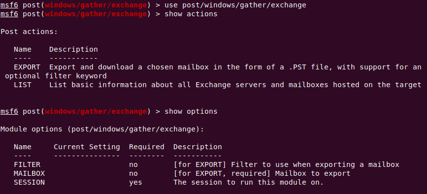
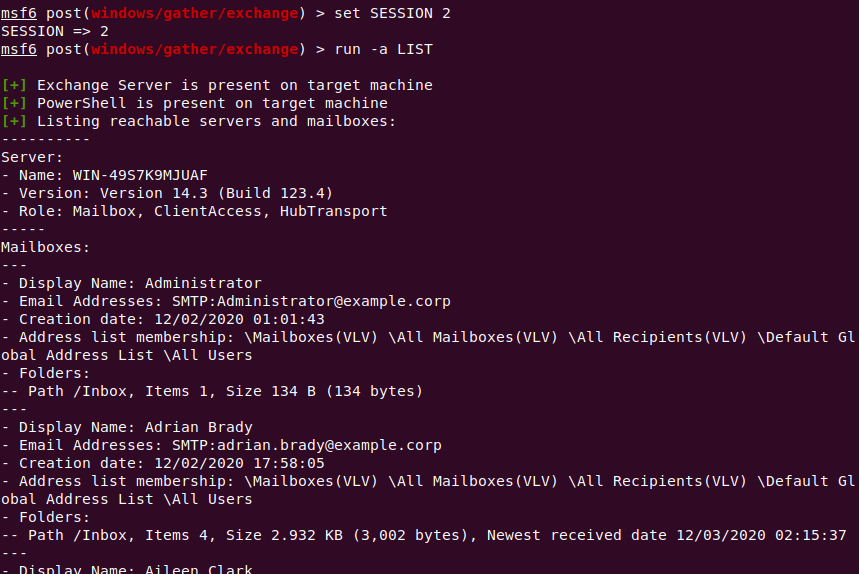

Metasploit Post-Exploitation Gather module for Exchange Server
--------------------------------------------------------------

A Metasploit framework module for gathering information from an on-premise Exchange Server.

The module gathers information from an Exchange Server running on a compromised target over a Meterpreter session.

It utilizes the "Exchange Management Shell", a collection of PowerShell scripts installed along with Exchange Server.

## Usage

Two actions are supported:

#### LIST (default action)
Query the local Exchange server and retrieve basic information about each of the mailboxes it hosts.

#### EXPORT
Export and download a chosen mailbox in the form of a .PST file, with support for an optional filter keyword.
Options:
* MAILBOX: Display name or e-mail address
* FILTER: Optional, can be used to refine the exported results (e.g. only export items received on a particular date)
   
    For a list of valid filters, see https://docs.microsoft.com/en-us/exchange/filterable-properties-for-the-contentfilter-parameter

-----------------

The executing user has to be assigned to the "Organization Management" role group for the module to successfully run.

The module might not function correctly if Windows Defender is enabled and detects the PowerShell script as malicious.

Tested on Exchange Server 2010 on Windows Server 2012 R2 and Exchange Server 2016 on Windows Server 2016.
